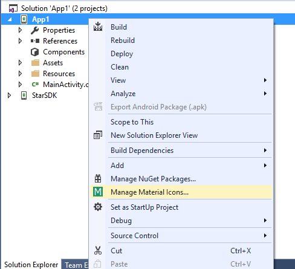
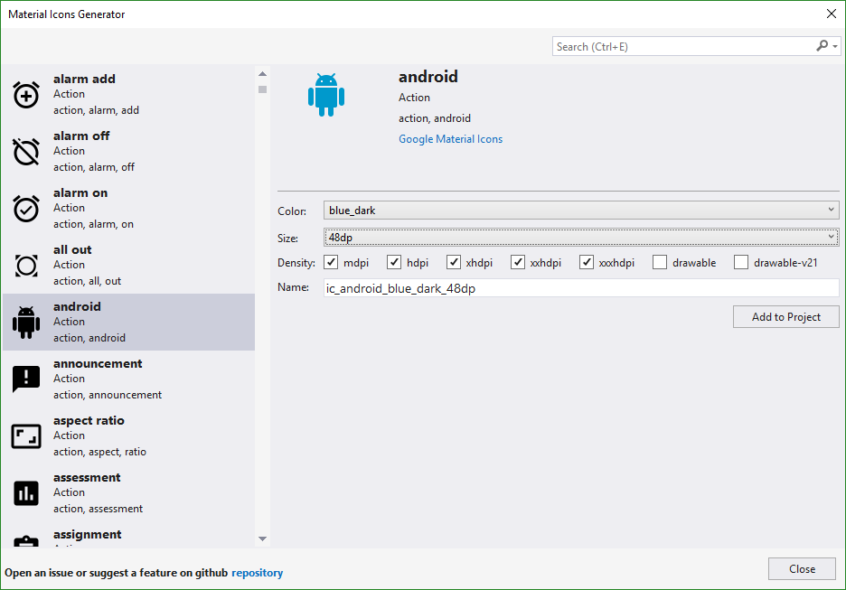

# Material icons generator

Download this extension from the [VS Gallery](https://visualstudiogallery.msdn.microsoft.com/3741d776-755b-4002-a6be-e86fa605a315)
or get the [CI build](http://vsixgallery.com/extension/e1bf5443-bf81-49e6-bc33-004e1f1f7b02/).

---------------------------------------

This plugin help you to set material design icons to your Android or iOS project

See the [changelog](CHANGELOG.md) for changes and roadmap.

## Features

- Add icons from google public icons repo
- Support for Xamarin.Android project
- Support for Xamarin.iOS project

### Add Icons
Right-click on your Project and click "Manage Material Icons..."

## Contribute
Check out the [contribution guidelines](CONTRIBUTING.md)
if you want to contribute to this project.

For cloning and building this project yourself, make sure
to install the
[Extensibility Tools 2015](https://visualstudiogallery.msdn.microsoft.com/ab39a092-1343-46e2-b0f1-6a3f91155aa6)
extension for Visual Studio which enables some features
used by this project.

## Xamarin Studio
* [xs-material-icons-generator](https://github.com/interisti/xs-material-icons-generator)

## Credits
* Inspired by [android-material-design-icon-generator-plugin](https://github.com/konifar/android-material-design-icon-generator-plugin)
* Icons From [Google's Material Design Icons Repository](https://github.com/google/material-design-icons)

## License
[Apache 2.0](LICENSE)
